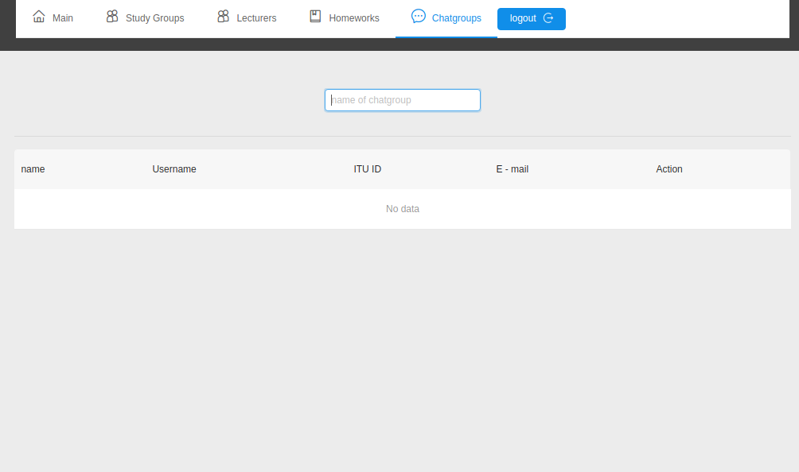
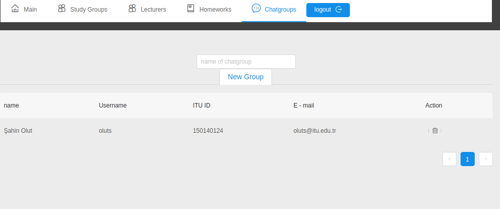
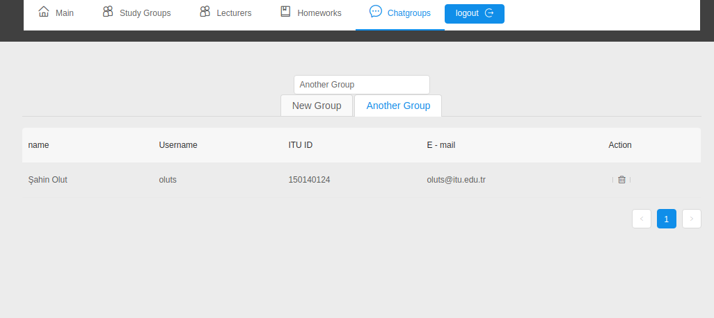

### Chatgroups page

In this page, student can join/leave/create chatgroups. They are able to talk in real time in chatgroup.(Socket protocol is established but not integreted to page yet)

- The box above allows students to form chatgroups. You can write the name of chatgroup and by hitting enter key, you form a new chat group.

- Chatgroups that you've joined is shown on tabs, you can switch between chatgroups by clicking on them. Also if you git cross on tab, you leave the group.

- If you are admin, you can remove students from groups.