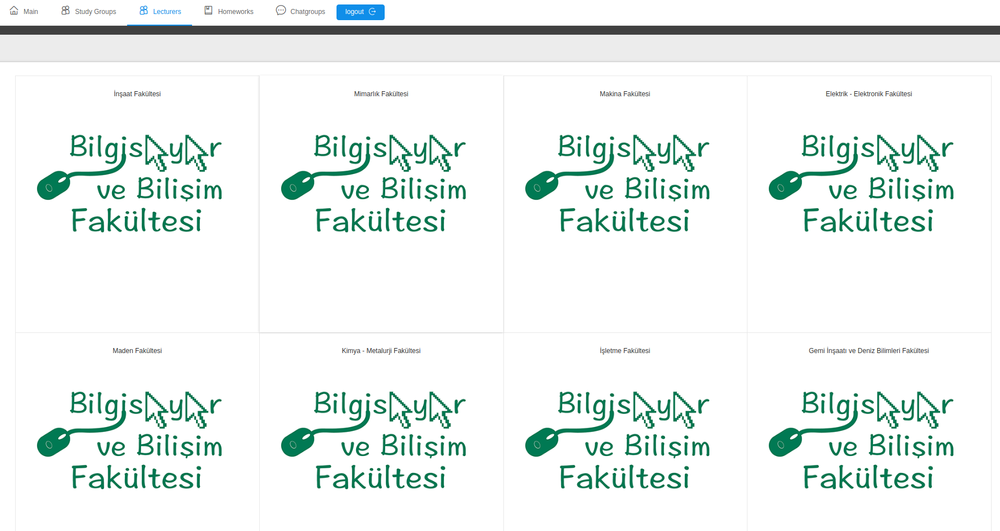
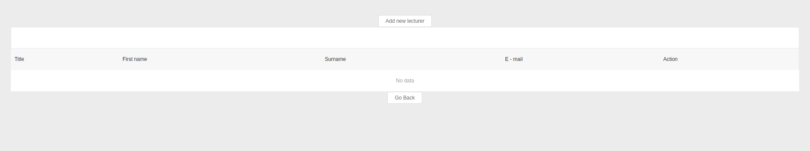
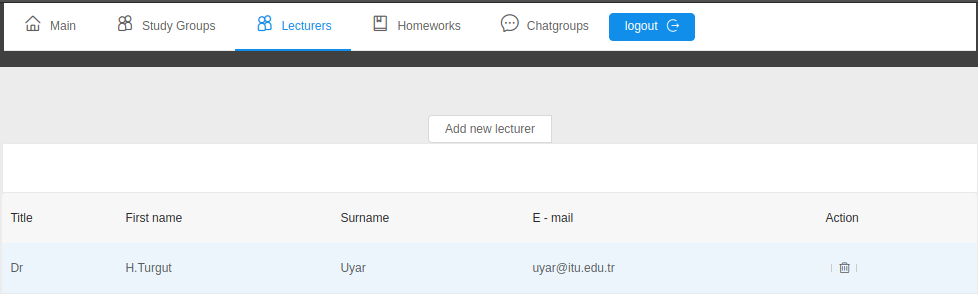

### Lecturers Page

This page allows students to reach information about lecturers. First the deparment is chosen, after it is chosen, lecturers of that department are shown. They can remove, add, show lecturers. Clicking on the thrashcan will remove the lecturers from the database, however this feature are not working well because of some troubles while developing web app.

By clicking the add new lecturer button, a new modal will appear and student are able to add new lecturer.

