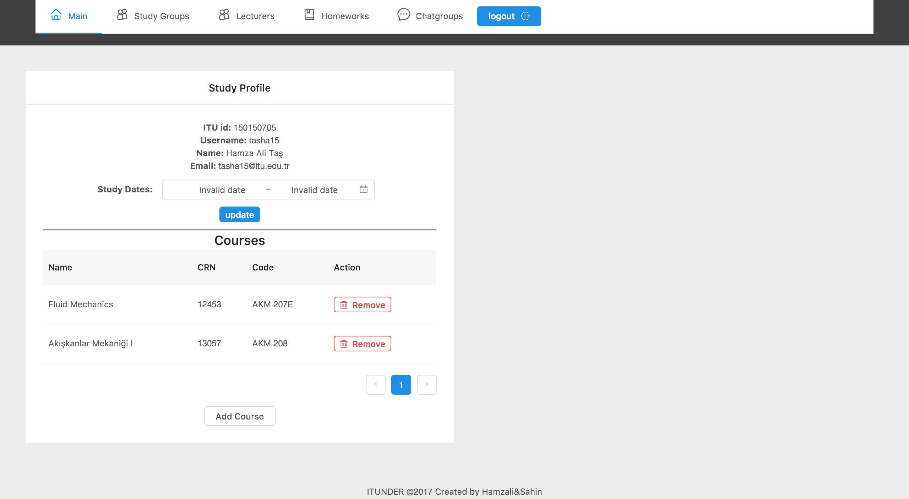

### Main Page

This page provides to modify the details of a logged in student  and add or remove courses.

##### Student Details

- Before login nothing is visible to user only a message in the main page.

- For details to be available user must login using the login button with ITU credentials. Login system uses the ITU Mobile api to fetch the relevant student data.

- After login student profile details and courses will be visible.

- Study date preference details can be changed in the Study Profile section.

#### Courses

- Courses details are visible in courses section. New courses can be added by clicking on add course and can be deleted with remove button.

- After clicking the add course course list will appear.

- Search with crn, course name or course code with the text search above.

- When add is clicked on the course list element, it will add the course to your list.

