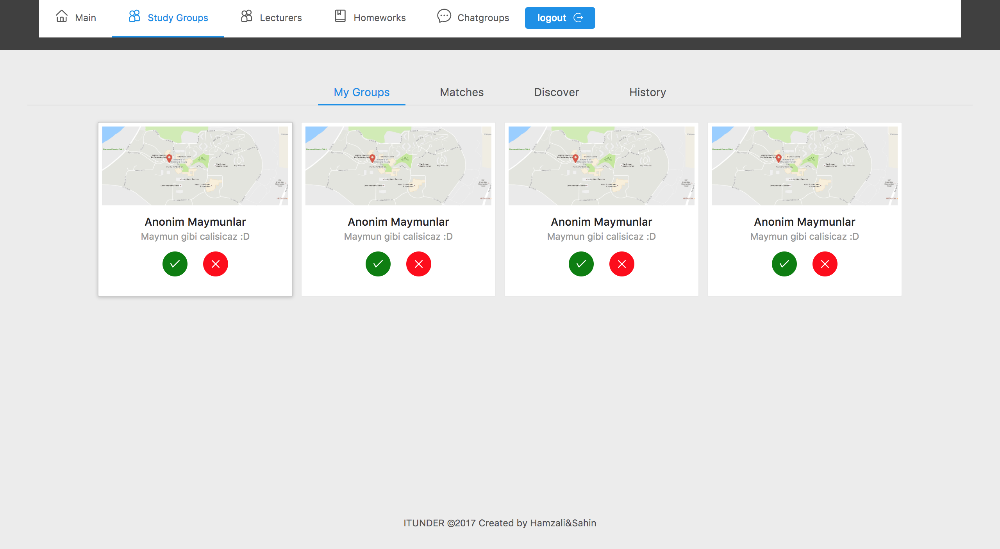

### Study Group Page

I could not able to finish the page functionality however in the backend(REST API) I finished all the database operations of this page.

Finished APIs
- List matches 
GET /studygroups
- List my study groups 
GET /student/studygroups
- List my study groups history and stasuses 
GET /studygroups/:studentid
- View study group by id 
GET /studygroups/:studygroupid
- List students of studygroup 
GET /studygroups/:studygroupid/students
- Create, Update, Delete my study group 
POST, PUT, DELETE /studygroups/:studygroupid
- Accept, Join or leave study group 
GET, POST /studygroups/:studygroupid/students/:studentid/status

*for all end points requires authentication and authorization.

